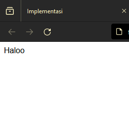

**TUGAS EXPLORASI
ATAS NAMA : HANSAR**
# Apa Itu Box-Shadow

Box shadow adalah salah satu properti CSS yang memungkinkan Anda untuk menambahkan bayangan ke elemen HTML. Dengan menggunakan properti ini, Anda dapat memberikan efek bayangan yang memberi kedalaman dan dimensi pada elemen, sehingga memungkinkan Anda untuk menciptakan tata letak yang lebih menarik dan dinamis. Bayangan yang dihasilkan dapat diberikan warna, ukuran, sudut, dan opasitas tertentu sesuai kebutuhan desain Anda.

# CSS box-shadow Property
## Tentukan Shadow Horizontal dan Vertikal
Property `box-shadow` memiliki dua nilai yang mengontrol pergeseran horizontal dan vertikal dari bayangan yang dihasilkan:

1. **Horizontal Offset**: Ini adalah nilai yang menentukan seberapa jauh bayangan akan dipindahkan secara horizontal dari elemen. Jika Anda ingin bayangan muncul di sebelah kiri elemen, nilai horizontal offset harus bernilai negatif. Jika Anda ingin bayangan muncul di sebelah kanan elemen, nilai horizontal offset harus bernilai positif.
    
2. **Vertical Offset**: Ini adalah nilai yang menentukan seberapa jauh bayangan akan dipindahkan secara vertikal dari elemen. Jika Anda ingin bayangan muncul di atas elemen, nilai vertical offset harus bernilai negatif. Jika Anda ingin bayangan muncul di bawah elemen, nilai vertical offset harus bernilai positif.

## Contoh Kode Program

```html
<!DOCTYPE html>
<html lang="en">
<head>
    <title>Document</title>
    <link rel="stylesheet" href="Tgs_box.css">
</head>
<style>
  img {
    width: 100px;
    height: 100px;
    box-shadow: 20px 20px 10px grey;
}
</style>
<body>
    
</body>
</html>
```

## Hasil

![[IMG_20240428_233031.jpg]]

### Penjelasan

1. `<!DOCTYPE html>`: Ini adalah deklarasi untuk jenis dokumen HTML yang digunakan, yang merupakan standar untuk semua dokumen HTML.

2. `<html lang="en">`: Ini adalah tag pembuka untuk elemen HTML. `lang="en"` menandakan bahwa bahasa yang digunakan dalam dokumen adalah bahasa Inggris.

3. `<head>`: Ini adalah elemen yang berisi informasi metadata tentang dokumen HTML, seperti judul, tautan ke file eksternal (CSS atau JavaScript), dan lain-lain.

4. `<title>Document</title>`: Ini adalah judul dokumen yang akan ditampilkan di tab browser.

5. `<link rel="stylesheet" href="Tgs_box.css">`: Ini adalah tag untuk menautkan dokumen HTML dengan file CSS eksternal yang disebut "Tgs_box.css". Ini digunakan untuk memformat tata letak dan gaya visual dari elemen-elemen di dalam dokumen.

6. `<style>`: Ini adalah tag untuk menambahkan gaya CSS langsung ke dalam dokumen HTML.

7. `img`: Ini adalah elemen untuk menampilkan gambar. Di sini, gaya CSS diterapkan langsung kepada elemen gambar untuk memberikan bayangan dengan efek `box-shadow`.

8. `src="ff.jpg" width="100px" height="100px"`: Ini adalah atribut-atribut elemen gambar. `src` menunjukkan lokasi file gambar, sedangkan `width` dan `height` mengatur lebar dan tinggi gambar, masing-masing 100 piksel.

9. `<body>`: Ini adalah elemen yang berisi konten yang akan ditampilkan pada halaman web. Di sini, hanya terdapat satu elemen gambar.

## Color for the Shadow

#### Code program

```html

<!DOCTYPE html>
<html lang="en">
<head>
<meta charset="UTF-8">
<meta name="viewport" content="width=device-width, initial-scale=1.0">
<title>Colored Shadow</title>
<style>
    .box {
        width: 200px;
        height: 200px;
        background-color: #f0f0f0;
        position: relative;
    }

    .shadow {
        position: absolute;
        top: 10px;
        left: 10px;
        width: 100%;
        height: 100%;
        box-shadow: 10px 10px 20px rgba(255, 0, 0, 0.5); /* Ubah nilai RGBA sesuai dengan warna yang Anda inginkan */
    }
</style>
</head>
<body>
    <div class="box">
        <div class="shadow"></div>
    </div>
</body>
</html>
```

### Hasil

![[IMG_20240429_071638.jpg]]

### penjelasan

1. `<!DOCTYPE html>`: Mendefinisikan tipe dokumen sebagai HTML.
2. `<html lang="en">`: Mulai dari sini adalah elemen HTML yang merupakan akar dari halaman web dan mendefinisikan bahasa sebagai bahasa Inggris.
3. `<head>`: Bagian kepala dokumen HTML yang berisi informasi tentang dokumen, seperti tautan ke file CSS, metadata, dll.
4. `<meta charset="UTF-8">`: Mendefinisikan karakter set dokumen sebagai UTF-8, yang merupakan standar untuk representasi karakter dalam dokumen HTML.
5. `<meta name="viewport" content="width=device-width, initial-scale=1.0">`: Menentukan cara browser harus menyesuaikan ukuran dan skala halaman pada perangkat yang berbeda.
6. `<title>Colored Shadow</title>`: Judul halaman yang akan ditampilkan di bilah judul browser.
7. `<style>`: Bagian untuk menuliskan CSS inline yang diterapkan pada halaman HTML.
8. `.box`: Kelas CSS yang mendefinisikan atribut-atribut dari kotak utama.
    - `width: 200px; height: 200px;`: Menentukan lebar dan tinggi kotak.
    - `background-color: #f0f0f0;`: Memberikan warna latar belakang kotak.
    - `position: relative;`: Menentukan posisi kotak relatif terhadap posisi normalnya.
9. `.shadow`: Kelas CSS yang mendefinisikan atribut-atribut bayangan.
    - `position: absolute;`: Menentukan posisi bayangan terhadap posisi normalnya.
    - `top: 10px; left: 10px;`: Menentukan jarak bayangan dari kotak utama.
    - `width: 100%; height: 100%;`: Menentukan ukuran bayangan sama dengan kotak utama.
    - `box-shadow: 10px 10px 20px rgba(255, 0, 0, 0.5);`: Menentukan bayangan dengan offset horizontal 10px, offset vertikal 10px, blur radius 20px, dan warna bayangan merah dengan opacity 0.5. (Nilai RGBA dapat diubah sesuai dengan warna yang diinginkan)
10. `<div class="box">`: Membuat sebuah div dengan kelas "box" yang akan menampilkan kotak utama.
11. `<div class="shadow"></div>`: Membuat sebuah div dengan kelas "shadow" yang akan menampilkan bayangan di dalam kotak utama.

