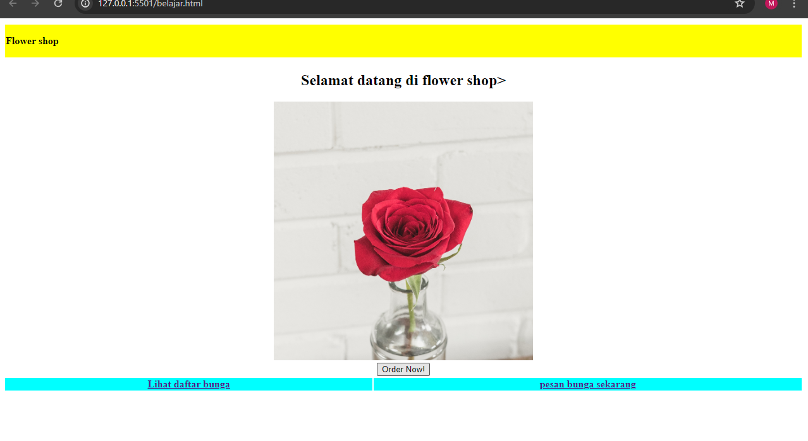
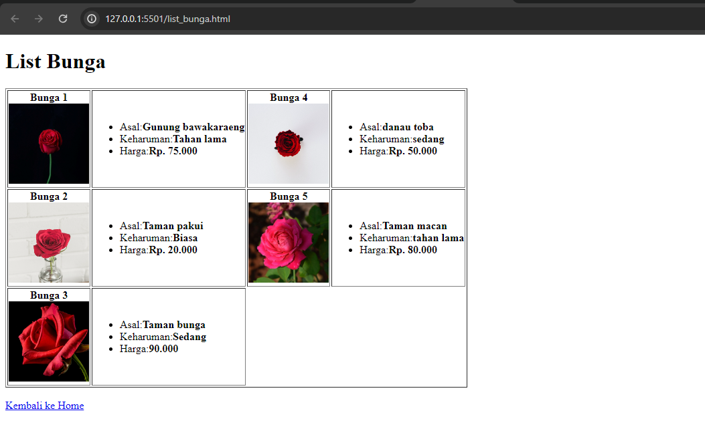

# Index Bunga

## Kode Program
```html
<!DOCTYPE html>

<html lang="en">

<head>

    <meta charset="UTF-8">

    <meta name="viewport" content="width=device-width, initial-scale=1.0">

    <title>Flower shop</title>

</head>

<body>

   <table height="100%" width="100%">

<tr>

    <th colspan="2" style="background-color: yellow;" align="left">

        <p>Flower shop</p>

    </th>

</tr>

<tr>

    <th colspan="2">

        <h2 align="center"> Selamat datang di flower shop></h2>

        

    </th>

    <tr>

   <th colspan="2"align="center" height="50%">

<from>

    <input type="submit" value="Order Now!">

</th>

</from>

    </tr>

</tr>

<tr style="background-color: aqua;">

    <th>

        <a href="list_bunga.html">Lihat daftar bunga</a>

    </th>

  <th>

    <a href="order_bunga.html">pesan bunga sekarang</a>

  </th>

</tr>

  

   </table>

</body>

</html>
```

## Hasil



## Analisis
1. `<!DOCTYPE html>`: Mendefinisikan jenis dokumen HTML yang digunakan, dalam hal ini HTML versi terbaru.
   
2. `<html lang="en">`: Menandakan awal dari dokumen HTML dan menentukan bahasa yang digunakan dalam dokumen, dalam hal ini bahasa Inggris.

3. `<head>`: Bagian kepala dokumen HTML yang berisi informasi-informasi metadata, seperti judul, tautan ke stylesheet, dan lain-lain.

4. `<meta charset="UTF-8">`: Menentukan karakter encoding yang digunakan dalam dokumen, dalam hal ini UTF-8 untuk mendukung karakter internasional.

5. `<meta name="viewport" content="width=device-width, initial-scale=1.0">`: Mendefinisikan tampilan viewport untuk perangkat mobile, yang memberitahu browser bagaimana menyesuaikan ukuran halaman dan skala awalnya.

6. `<title>ujian</title>`: Menentukan judul dokumen yang akan ditampilkan di tab browser.

7. `</head>`: Menandakan akhir dari bagian kepala dokumen HTML.

8. `<body>`: Bagian utama dari dokumen HTML yang berisi konten yang akan ditampilkan di halaman web.

9. `<table height="100%" width="100%">`: Mendefinisikan sebuah tabel dengan lebar dan tinggi 100% dari lebar dan tinggi viewport browser.

10. `<tr>`: Mendefinisikan sebuah baris dalam tabel.

11. `<th colspan="2" style="background-color: yellow;" align="left">`: Mendefinisikan sebuah sel header yang memiliki colspan 2, latar belakang berwarna kuning, dan teksnya rata kiri.

12. `<p>flower Shop</p>`: Menampilkan teks "flower Shop" di dalam sel header.

13. `</th>`: Menandakan akhir dari sel header.

14. `<tr>`: Mendefinisikan sebuah baris baru dalam tabel.

15. `<th colspan="2">`: Mendefinisikan sebuah sel header yang memiliki colspan 2.

16. `<h2 align="center">Selamat datang di flower shop</h2>`: Menampilkan judul di tengah dengan ukuran heading 2.

17. ``: Menampilkan gambar dengan sumber file "3.jpg" yang berukuran 410x410 piksel dan di-alignment ke tengah.

18. `</th>`: Menandakan akhir dari sel header.

19. `<tr>`: Mendefinisikan sebuah baris baru dalam tabel.

20. `<th colspan="2" align="center" height="50">`: Mendefinisikan sebuah sel header yang memiliki colspan 2, di-align ke tengah, dan tingginya 50 piksel.

21. `<form>`: Mendefinisikan sebuah form.

22. `<input type="submit" value="Order Now!">`: Menampilkan tombol submit dengan teks "Order Now!".

23. `</form>`: Menandakan akhir dari form.

24. `</th>`: Menandakan akhir dari sel header.

25. `<tr style="background-color: aqua;">`: Mendefinisikan sebuah baris baru dalam tabel dengan latar belakang berwarna aqua.

26. `<th>`: Mendefinisikan sebuah sel header.

27. `<a href="listbunga.html">Lihat daftar bunga</a>`: Menampilkan tautan untuk menuju halaman "listbunga.html" dengan teks "Lihat daftar bunga".

28. `</th>`: Menandakan akhir dari sel header.

29. `<th>`: Mendefinisikan sebuah sel header.

30. `<a href="orderan_bunga.html">pesan bunga sekarang</a>`: Menampilkan tautan untuk menuju halaman "orderan_bunga.html" dengan teks "pesan bunga sekarang".

31. `</th>`: Menandakan akhir dari sel header.

32. `</tr>`: Menandakan akhir dari baris dalam tabel.

33. `</table>`: Menandakan akhir dari tabel.

34. `</body>`: Menandakan akhir dari bagian konten dokumen HTML.

35. `</html>`: Menandakan akhir dari dokumen HTML.

# List Bunga
## Kode Program
```html
<!DOCTYPE>
<html>
  <head>
    <title>Daftar bunga</title>
  </head>
  <body>
    <h1>list bunga</h1>
    <table border="1">
      <tr>
        <th>
          <b>Bunga 1</b></b>
          
        </th>
        <td>
          <ul>
            <li>Asal:<b>Gunung Bawakaraeng</b></li>
            <li>Keharuman:<b>Tahan lama</b></li>
            <li>Harga:<b>Rp. 75.000</b></li>
          </ul>
        </td>
        <th>
          <b>Bunga 4</b></b>
          
        </th>
        <td>
          <ul>
            <li>Asal:<b>danau toba</b></li>
            <li>Keharuman:<b>sedang</b></li>
            <li>Harga:<b>Rp. 50.00</b></li>
          </ul>
        </td>
      </tr>
      <tr>
        <th>
          <b>Bunga 3</b></b>
          
        </th>
        <td>
          <ul>
            <li>Asal:<b>Taman Pakui</b></li>
            <li>Keharuman:<b>Biasa</b></li>
            <li>Harga:<b>Rp. 20.000</b></li>
          </ul>
        </td>
        <th>
          <b>Bunga 5</b></b>
          
        </th>
        <td>
          <ul>
            <li>Asal:<b>Taman macan</b></li>
            <li>Keharuman:<b>Tahan</b></li>
            <li>Harga:<b>Rp. 80.00</b></li>
          </ul>
        </td>
      </tr>
      <th>
          <b>Bunga 3</b></b>
          
        </th>
        <td>
          <ul>
            <li>Asal:<b>Taman Bunga</b></li>
            <li>Keharuman:<b>Sedang</b></li>
            <li>Harga:<b>Rp. 90.000</b></li>
          </ul>
        </td>
        <th colspan="2" align="center" bgcolor="grey">-</th>
        <tr>
          <th colspan="4" bgcolor="red">
            <a href="order_bunga.html">Pesan Bunga</a>
            </tr>
            </tr>
            </table><br>
           <a href="index_bunga.html">Kembali ke Home</a>
            
  </body>
</html>
```



## Analisis
1. `<!DOCTYPE html>`: Mendefinisikan jenis dokumen HTML yang digunakan, dalam hal ini HTML versi terbaru.
    
2. `<html lang="en">`: Menandakan awal dari dokumen HTML dan menentukan bahasa yang digunakan dalam dokumen, dalam hal ini bahasa Inggris.
    
3. `<head>`: Bagian kepala dokumen HTML yang berisi informasi-informasi metadata, seperti judul, tautan ke stylesheet, dan lain-lain.
    
4. `<title>Daftar bunga</title>`: Menentukan judul dokumen yang akan ditampilkan di tab browser.
    
5. `</head>`: Menandakan akhir dari bagian kepala dokumen HTML.
    
6. `<body>`: Bagian utama dari dokumen HTML yang berisi konten yang akan ditampilkan di halaman web.
    
7. `<h1>List Bunga</h1>`: Menampilkan heading level 1 dengan teks "List Bunga".
    
8. `<table border="1">`: Mendefinisikan sebuah tabel dengan atribut border yang memiliki nilai 1.
    
9. `<tr>`: Mendefinisikan sebuah baris dalam tabel.
    
10. `<th>`: Mendefinisikan sebuah sel header dalam tabel.
    
11. `<b>Bunga 1</b><br>`: Menampilkan teks tebal "Bunga 1" diikuti dengan tag line break.
    
12. ``: Menampilkan gambar dengan sumber file "1.jpg" dan ukuran 120x120 piksel.
    
13. `</th>`: Menandakan akhir dari sel header.
    
14. `<td>`: Mendefinisikan sebuah sel data dalam tabel.
    
15. `<ul>`: Mendefinisikan sebuah daftar tak-berurutan (unordered list).
    
16. `<li>Asal:<b>Gunung bawakaraeng</b></li>`: Menampilkan item daftar dengan teks "Asal: Gunung bawakaraeng" yang ditampilkan dalam format tebal.
    
17. `<li>Keharuman:<b>Tahan lama</b></li>`: Menampilkan item daftar dengan teks "Keharuman: Tahan lama" yang ditampilkan dalam format tebal.
    
18. `<li>Harga:<b>Rp. 75.000</b></li>`: Menampilkan item daftar dengan teks "Harga: Rp. 75.000" yang ditampilkan dalam format tebal.
    
19. `</ul>`: Menandakan akhir dari daftar tak-berurutan.
    
20. `</td>`: Menandakan akhir dari sel data.
    
21. `<th>`: Mendefinisikan sebuah sel header dalam tabel.
    
22. `<b>Bunga 4</b><br>`: Menampilkan teks tebal "Bunga 4" diikuti dengan tag line break.
    
23. ``: Menampilkan gambar dengan sumber file "2.jpg" dan ukuran 120x120 piksel.
    
24. `</th>`: Menandakan akhir dari sel header.
    
25. `<td>`: Mendefinisikan sebuah sel data dalam tabel.
    
26. `<ul>`: Mendefinisikan sebuah daftar tak-berurutan (unordered list).
    
27. `<li>Asal:<B>danau toba</B></li>`: Menampilkan item daftar dengan teks "Asal: danau toba" yang ditampilkan dalam format tebal.
    
28. `<li>Keharuman:<b>sedang</b></li>`: Menampilkan item daftar dengan teks "Keharuman: sedang" yang ditampilkan dalam format tebal.
    
29. `<li>Harga:<b>Rp. 50.000</b></li>`: Menampilkan item daftar dengan teks "Harga: Rp. 50.000" yang ditampilkan dalam format tebal.
    
30. `</ul>`: Menandakan akhir dari daftar tak-berurutan.
    
31. `</td>`: Menandakan akhir dari sel data.
    
32. `</tr>`: Menandakan akhir dari baris dalam tabel.
    
33. `<th>`: Mendefinisikan sebuah sel header dalam tabel.
    
34. `<b>Bunga 2</b><br>`: Menampilkan teks tebal "Bunga 2" diikuti dengan tag line break.
    
35. ``: Menampilkan gambar dengan sumber file "3.jpg" dan ukuran 120x120 piksel.
    
36. `</th>`: Menandakan akhir dari sel header.
    
37. `<td>`: Mendefinisikan sebuah sel data dalam tabel.
    
38. `<ul>`: Mendefinisikan sebuah daftar tak-berurutan (unordered list).
    
39. `<li>Asal:<b>Taman pakui</b></li>`: Menampilkan item daftar dengan teks "Asal: Taman pakui" yang ditampilkan dalam format tebal.
    
40. `<li>Keharuman:<b>Biasa</b></li>`: Menampilkan item daftar dengan teks "Keharuman: Biasa" yang ditampilkan dalam format tebal.
    
41. `<li>Harga:<b>Rp. 20.000</b></li>`: Menampilkan item daftar dengan teks "Harga: Rp. 20.000" yang ditampilkan dalam format tebal.
    
42. `</ul>`: Menandakan akhir dari daftar tak-berurutan.
    
43. `</td>`: Menandakan akhir dari sel data.
    
44. `<th>`: Mendefinisikan sebuah sel header dalam tabel.
    
45. `<b>Bunga 5</b><br>`: Menampilkan teks tebal "Bunga 5" diikuti dengan tag line break.
    
46. ``: Menampilkan gambar dengan sumber file "4.jpg" dan ukuran 120x120 piksel.
    
47. `</th>`: Menandakan akhir dari sel header.
    
48. `<td>`: Mendefinisikan sebuah sel data dalam tabel.
    
49. `<ul>`: Mendefinisikan sebuah daftar tak-berurutan (unordered list).
    
50. `<li>Asal:<b>Taman macan</b></li>`: Menampilkan item daftar dengan teks "Asal: Taman macan" yang ditampilkan dalam format tebal.
    
51. `<li>Keharuman:<b>tahan lama</b></li>`: Menampilkan item daftar dengan teks "Keharuman: tahan lama" yang ditampilkan dalam format tebal.
    
52. `<li>Harga:<b>Rp. 80.000</b></li>`: Menampilkan item daftar dengan teks "Harga: Rp

# Order Bunga

## Kode  
```html
<!DOCTYPE html>
<html>
  <head>
    <title>order bunga</title>
  </head>
  <body>
    <h1>Pesan Bunga</h1>
    <form>
      <b>Nama:</b><br>
      <input type="text"></label><br>
      <br>
      <b>Jenis Bunga</b><br>
      <select>
        <option>Bunga 1</option>
        <option>Bunga 2</option>
        <option>Bunga 3</option>
        <option>Bunga 4</option>
        <option>Bunga 5</option>
      </select><br>
      <br>
      <b>Jenis Pembayaran</b><br>
      <input type="radio" name="jp">
      <label>Tunai</label>
      <input type="radio" name="jp">
      <label>Transfer</label><br>
      <br>
      <b>Alamat Pengiriman</b><br>
      <textarea cols="30" rows="5"></textarea><br>
      <label><b>Waktu Pengiriman</b></label><br>
      <input type="checkbox">
      <label>pagi</label>
      <input type="checkbox">
      <label>siang</label>
      <input type="checkbox">
      <label>sore</label>
      <input type="checkbox"><br>
      <br>
      <input type="submit" value="Pesan">
     <input type="submit" value="Hapus"><br>
     <br>
     <hr></hr>
     
     <a href="list_bunga.html">lihat daftar bunga</a><br>
     <a href="index_bunga.html">kembali ke home</a>
    </form>
  </body>
</html>
```

## Analisis
Deklarasi DOCTYPE: <!DOCTYPE html> digunakan untuk menunjukkan bahwa dokumen ini adalah dokumen HTML5.

Elemen <`html`>: Ini adalah elemen root dari halaman HTML.

Elemen <`head>`: Ini berisi informasi tentang dokumen seperti judul dan meta-data. Di dalam <`head`>, ada:

Elemen <`title`>: Menentukan judul halaman, yang akan ditampilkan di tab browser.
Elemen <`body`>: Ini berisi semua konten yang akan ditampilkan di halaman web. Di dalam <`body`>, terdapat:

Elemen <`h1`>: Menampilkan judul utama halaman.
Elemen <`form`>: Ini adalah formulir yang berisi input yang akan diisi oleh pengguna untuk memesan bunga.
Elemen <`b`>: Menandai teks tebal.
Elemen <`input`>: Memungkinkan pengguna memasukkan data, seperti nama dan alamat.
Elemen <`select`>: Menampilkan dropdown dengan beberapa opsi, dalam hal ini berisi jenis-jenis bunga yang bisa dipilih.
Elemen <`option`>: Menampilkan opsi dalam dropdown.
Elemen <`textarea`>: Memungkinkan pengguna memasukkan teks yang lebih panjang, dalam hal ini untuk alamat pengiriman.
Elemen <`input type="radio"`>: Memungkinkan pengguna memilih satu opsi dari beberapa opsi, dalam hal ini untuk jenis pembayaran.
Elemen <`input type="checkbox"`>: Memungkinkan pengguna memilih beberapa opsi sekaligus, dalam hal ini untuk waktu pengiriman.
Elemen <`input type="submit"`>: Tombol untuk mengirimkan formulir atau menghapus data yang telah dimasukkan.
Elemen <`hr`>: Membuat garis horizontal untuk memisahkan bagian-bagian di halaman.
Elemen <`a`>: Membuat hyperlink, dalam hal ini untuk mengarahkan pengguna ke halaman lain.
Atribut href: Menentukan alamat tujuan hyperlink.
Teks di antara tag <`a> dan </a`>: Teks yang akan ditampilkan sebagai hyperlink

## Hasil
![[remedial2.png]]

